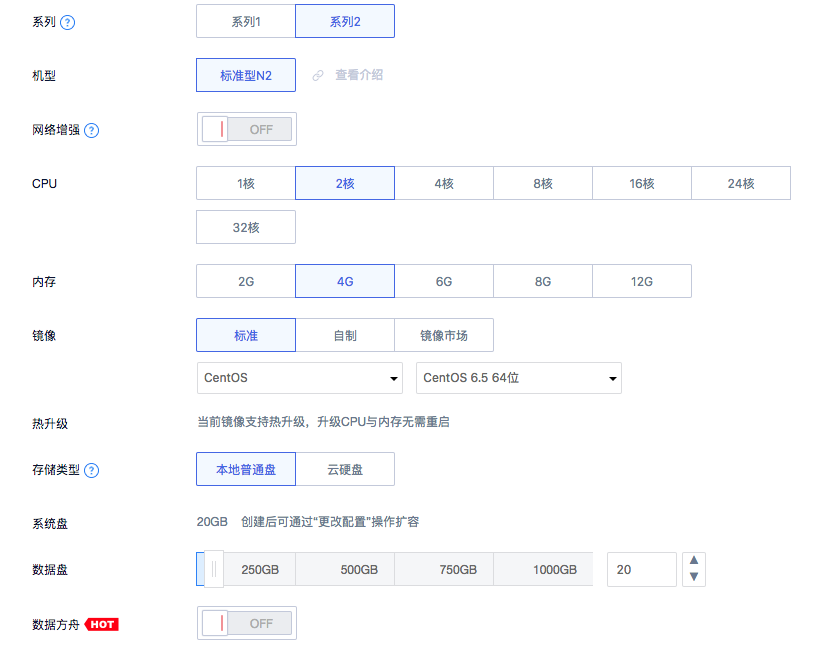

# 主机

## 创建主机

在UHost管理控制台左上方区域点击“创建主机”，出现创建主机向导：

1）选择地域/可用区，不同地域/可用区下的云主机可选配置稍有差异；


2）选择系列、机型、CPU、内存、镜像与磁盘配置；



3）选择所属VPC、所属子网、是否绑定外网弹性IP以及防火墙设置（绑定外网弹性IP可后续另行配置）；


4）选择所属业务组，设置主机名称与管理员密码；


5）选择购买数量和付费方式，点击“立即购买”，进入支付确认页面；或选择“加入清单”，稍后购买；


6）在支付确认页面，对您所购买的资源和账户余额进行最终确认，无误后点击“确认支付”；

7）回到云主机的资源列表页，您可以看到该台主机在“初始化”中，通常在分钟级别内，主机即可创建完成。

更多详情参见[云主机快速上手指南](/compute/uhost/newuser/briefguide)

## 主机管理

创建完成后，可对您的云主机进行关闭、重启、断电、删除等常规操作，且均支持多台批量处理。


## 主机名/备注修改

主机名和备注信息都支持编辑修改，点击“主机名称”下的修改按钮或进入“详情”页面，均可执行修改操作。


## 业务组

您可对云主机进行分组，使得某些操作能以业务组为单位进行，省去逐个操作的繁琐，便于资源集中管理。

在“详情”页面中，可对云主机设置分组，组名相同的云主机即被归为同一组。后续查看监控数据或修改规则时，即可以组为单位进行操作。


## 登录(WEBVNC方式)

UHost支持使用Web VNC终端登录云主机，适合临时性操作，点击“登录”即可在新的浏览器窗口打开仿真的终端页面。


若打开终端页面后出现黑屏，说明系统可能处于休眠状态，按任意键即可恢复。


输入用户名和密码即可登录您的云主机进行相关操作，此外，由于协议限制，网页终端暂不支持键盘的组合快捷键，您可以在终端窗口左上角选择快捷键按钮，若您有更多快捷键的需求，请发送给技术支持。


注意事项：

  - 为了使客户获得更优质的体验，UCloud控制台不再支持IE9及以下版本的浏览器；
  - 使用终端完成操作后，请注意在操作系统内退出登录，当然超过默认退出时间，系统也会自动退出登录。

## 更换系统盘

更换系统盘前，请先确认云主机为“关机”状态，点击“更换系统盘”。


选择更改后的系统镜像，输入并确认管理员密码，点击“确认”即可更换系统盘。


注意事项：

  - 云主机必须关机才能更换系统盘；
  - 免费镜像重装为收费镜像，需补足差价，收费镜像重装为免费镜像，系统会发起退费；
  - 开启网络增强的云主机无法重装为不支持网络增强的系统（如Windows）；
  - GPU型云主机无法重装为不支持GPU的系统（如Redhat）；
  - 当重装为不同大版本的操作系统（如CentOS 6.x \<-\> CentOS
    7.x），请注意文件系统的变更，可能引起系统无法识别文件系统；
  - 数据盘为云盘时，重装后请重新在控制台上挂载。

## 重置主机密码

如果您遗失了云主机管理密码，可点击“重置密码”。


注意事项：

  - 请勿在制作镜像过程中重置密码；
  - 若系统已经更改了管理员用户名，则无法进行重置；
  - 重置密码需要在关机状态下操作。


您还可以使用[uhost reset-password](https://docs.ucloud.cn/developer/cli/cmd/ucloud/uhost/reset-password)（UCloud CLI）命令重置主机密码，并指定可用区和实例ID。请使用 --password参数按如下方式指定主机密码。
例如：


```
ucloud uhost reset-password --zone cn-bj2-05 --uhost-id uhost-0a3gcvih --password test12345
```


以上示例输出如下：


```
uhost[uhost-0a3gcvih] will be stopped, can we do this? (y/n):y
uhost[uhost-0a3gcvih] is shutting down...done
uhost[uhost-0a3gcvih] reset password
```


## 升级配置

若您需要更改云主机配置，可点选“更改配置”进入操作页面。


弹出窗口中可选择更改基础配置，例如升降级CPU、内存等，或升级外网弹性IP带宽，选择后点击“继续”。


进入配置修改页面，更改完核对价格后点击“确认”，若您的云主机尚未关机，系统会提示您是否关机后再操作。


升级完成后，机器处于关机状态，需要手动点击“启动”按钮开机。

注意事项：

  - 必须关机才能发起云主机配置修改；
  - 若更改系统盘大小，配置时间会较长，参考时间大约100G/30mins，扩容完成后无需进入系统进行手动调整；
  - 如果对数据盘进行了升级，升级后还需要在主机内进行磁盘扩容操作；详情参见：[磁盘扩容](/compute/uhost/guide/disk#磁盘扩容)
  - 数据盘无法缩容；
  - 网络增强云主机无法修改配置到4核以下。


您还可以使用[uhost resize](https://docs.ucloud.cn/developer/cli/cmd/ucloud/uhost/resize)（UCloud CLI）命令升级配置，并指定实例ID。请使用 --cpu参数和 --memory-gb参数按如下方式指定CPU核数和内存大小。
例如：
```
ucloud uhost resize --uhost-id uhost-0a3gcvih --cpu 2 --memory-gb 4
```

以上示例输出如下：
```
Resize uhost must be after stop it. Do you want to stop this uhost? (y/n):y
uhost[uhost-0a3gcvih] is shutting down...done
UHost:[uhost-0a3gcvih] resized...done
```

## 删除主机

若需删除云主机，点击“删除主机”，确认所有注意事项，此操作支持批量处理。


注意事项：

  - 云主机删除后，EIP仍被保留，并将持续计费，若不再需要，需至EIP页面删除；
  - 挂载的UDisk数据盘仍被保留，并将持续计费，若不再需要，需至UDisk页面删除；
  - 创建时长（删除时间-创建时间）\>7天的云主机被删除后将进入回收站，可以从回收站恢复；[详情](/compute/uhost/guide/recycle_bin)
  - 删除后，系统将自动退还租约中的剩余费用。


您还可以使用[uhost delete](https://docs.ucloud.cn/developer/cli/cmd/ucloud/uhost/delete)（UCloud CLI）命令删除主机，并指定实例ID。
例如：
```
ucloud uhost delete --uhost-id uhost-0a3gcvih
```

以上示例输出如下：
```
Are you sure you want to delete the host(s)? (y/n):y
uhost[uhost-0a3gcvih] is shutting down...done
uhost[uhost-0a3gcvih] deleted
```


## 开启/关闭网络增强

若需开启网络增强功能，点击“详情”，在配置信息中找到网络增强即可开启。


注意事项（若无法开启网络增强）：

  - 云主机镜像不支持网络增强，请重装系统，更换为支持网络增强的镜像后，再开启该特性；
  - CPU配置低于4核，请升级至4核或以上后开启；
  - 部分云主机可能因创建时间较早，后台宿主机不支持升级。

## 主机NTP配置操作指南

### 各地域NTP服务器IP

| 地域    | 可用区  | NTP服务器1       | NTP服务器2       | NTP服务器3           |
| ----- | ---- | ------------- | ------------- | ----------------- |
| 北京一   | 可用区A | 10.255.255.1  | 10.255.255.2  | 0.cn.pool.ntp.org |
| 北京二   | 可用区B | 10.9.255.1    | 10.9.255.2    | 0.cn.pool.ntp.org |
| 北京二   | 可用区C | 10.10.255.1   | 10.10.255.2   | 0.cn.pool.ntp.org |
| 北京二   | 可用区D | 10.19.255.1   | 10.19.255.2   | 0.cn.pool.ntp.org |
| 北京二   | 可用区E | 10.42.255.1   | 10.42.255.2   | 0.cn.pool.ntp.org |
| 广州    | 可用区B | 10.13.255.1   | 10.13.255.2   | 0.cn.pool.ntp.org |
| 上海金融云 | 可用区A | 10.15.255.1   | 10.15.255.2   | 0.cn.pool.ntp.org |
| 上海二   | 可用区A | 10.23.255.101 | 10.23.255.102 | 0.cn.pool.ntp.org |
| 上海二   | 可用区B | 10.23.255.101 | 10.23.255.102 | 0.cn.pool.ntp.org |
| 香港    | 可用区A | 10.8.255.1    | 10.8.255.2    | 0.cn.pool.ntp.org |
| 香港    | 可用区B | 10.8.255.1    | 10.8.255.2    | 0.cn.pool.ntp.org |
| 洛杉矶   | 可用区A | 10.11.255.1   | 10.11.255.2   | 0.cn.pool.ntp.org |
| 华盛顿   | 可用区A | 10.27.255.101 | 10.27.255.102 | 0.cn.pool.ntp.org |
| 新加坡   | 可用区A | 10.35.255.1   | 10.35.255.2   | 0.cn.pool.ntp.org |
| 曼谷    | 可用区A | 10.31.255.101 | 10.31.255.102 | 0.cn.pool.ntp.org |
| 高雄    | 可用区A | 10.37.255.101 | 10.37.255.102 | 0.cn.pool.ntp.org |
| 台北    | 可用区A | 10.41.255.1   | 10.41.255.2   | 0.cn.pool.ntp.org |
| 雅加达   | 可用区A | 10.45.255.1   | 10.45.255.2   | 0.cn.pool.ntp.org |
| 孟买    | 可用区A | 10.47.255.1   | 10.47.255.2   | 0.cn.pool.ntp.org |
| 首尔    | 可用区A | 10.33.255.101 | 10.33.255.102 | 0.cn.pool.ntp.org |
| 东京    | 可用区A | 10.40.255.1   | 10.40.255.2   | 0.cn.pool.ntp.org |
| 法兰克福  | 可用区A | 10.29.255.101 | 10.29.255.102 | 0.cn.pool.ntp.org |
| 莫斯科   | 可用区A | 10.39.255.1   | 10.39.255.2   | 0.cn.pool.ntp.org |
| 迪拜    | 可用区A | 10.44.255.1   | 10.44.255.2   | 0.cn.pool.ntp.org |
| 圣保罗   | 可用区A | 10.49.255.1   | 10.49.255.2   | 0.cn.pool.ntp.org |

> Note
> 
> 每台机器至少配置两个UCloud NTP server IP 和 一个外部NTP server, 分别对应下述文档中的 upstream1,
> upstream2, 和offical\_upstream3.

**CentOS/Ubuntu/Redhat/Debian/Gentoo操作系统修改NTP**

**NTP配置文件位置: /etc/ntp.conf**

修改方法

根据所在可用区添加对应的NTP服务器IP

```
restrict区域:
添加 restrict 10.255.255.1
添加 restrict 10.255.255.2

server区域:
原配置:
server 0.asia.pool.ntp.org
server 1.asia.pool.ntp.org
server 2.asia.pool.ntp.org
server 3.asia.pool.ntp.org (3.gentoo.pool.ntp.org)
替换为:
server 10.255.255.1 iburst minpoll 3 maxpoll 4 prefer
server 10.255.255.2 iburst minpoll 3 maxpoll 4 prefer
server 0.cn.pool.ntp.org iburst minpoll 3 maxpoll 4

作用: 缩短对时轮询周期，并首选UCloud的NTP服务
```

添加微调参数

```
添加 tinker dispersion 100
添加 tinker step 1800
添加 tinker stepout 3600

作用: 加速微调，控制微调范围
```

测试方法

* 重启ntp服务

```
CentOS/Redhat/Gentoo:
# service ntpd restart

Ubuntu:
# sudo service ntp restart

Debian:
# service ntp restart
```

查看NTP server IP

```
# ntpq -pn
如显示表格中UCloud server IP,则表示ntp配置正确
```

> Note
> 
> 确保机器在能够跳跃对时的情况下，先执行ntpdate或者date命令来设置时间，再启动ntp对时服务

```
具体操作:
# service ntpd stop
# ntpdate upstream1 或 # date -s "Y-m-D H:M:S"
# service ntpd start
```

### OpenSUSE

**NTP配置文件位置: /etc/ntp.conf**

修改方法

* 添加 restrict参数

```
restrict -4 default kod notrap nomodify nopeer noquery
restrict -6 default kod notrap nomodify nopeer noquery
```

根据所在可用区添加对应的NTP服务IP

```
restrict区域
添加 restrict 10.255.255.1
添加 restrict 10.255.255.2

server区域
原配置:
server 0.asia.pool.ntp.org
server 1.asia.pool.ntp.org
server 3.asia.pool.ntp.org (3.gentoo.pool.ntp.org)
替换为:
server 10.255.255.1 iburst minpoll 3 maxpoll 4 prefer
server 10.255.255.2 iburst minpoll 3 maxpoll 4 prefer
server 0.cn.pool.ntp.org iburst minpoll 3 maxpoll 4

作用: 缩短对时轮询周期，并首选UCloud的NTP服务
```

添加微调参数

```
添加 tinker dispersion 100
添加 tinker step 1800
添加 tinker stepout 3600

作用: 加速微调，控制微调范围
```

测试方法

* 重启ntp服务

```
# service ntp restart
```

查看NTP server IP

```
# ntpq -pn
如显示表格中UCloud server IP,则表示ntp配置正确
```

> Note
> 
> 确保机器在能够跳跃对时的情况下，先执行ntpdate或者date命令来设置时间，再启动ntp对时服务

```
具体操作:
# service ntpd stop
# ntpdate upstream1 或 # date -s "Y-m-D H:M:S"
# service ntpd start
```

可以下载并运行脚本以完成配置，参见
[mod\_ntp.sh](http://static.ucloud.cn/1314eec96e414fcb3daca5124dee4112.sh)

### Windows

修改Windows Time服务为自动启动

1) 在终端里输入"services.msc"，弹出服务列表，找到"Windows Time"将启动类型改为"自动"，并启动该服务；（如已启动则忽略）

2) 针对2008和2012用户，64位机器，需要在终端中输入"sc triggerinfo w32time start/networkon stop/networkoff"（以上命令为cmd命令，不可运行于powershell）。

修改组策略

**启动Windows NTP客户端**

1) 在终端中输入"gpedit.msc"，弹出组策略编辑器；

2) "计算机配置\\管理模板\\系统\\Windows时间服务\\时间提供程序\\配置Windows NTP客户端"，将其状态修改为"已启用"。

**配置Windows NTP客户端参数**

1) 配置对应可用区的"NtpServer"值为"upstream1,0x9 upstream2, 0x9official_upstream3,0x9"；

2) 修改"类型"值为NTP；

3) 修改"SpecialPollInterval"为30-60s之间的数值。

**启用全局配置(计算机配置管理模板系统Windows时间服务全局配置设置)**

```
修改"MaxAllowPhaseOffset"为3600
修改"MaxNegPhaseCorrection"为3600
修改"MaxPosPhaseCorrection"为3600
修改"PhaseCorrectRate"值为"7"
修改"MinPollInterval"值为"3"
修改"MaxPollInterval"值为"4"
```

测试方法

1) 命令行执行 gpupdate /force 强制更新组策略；

2) 按照以上配置完成后，确保机器可以跳跃对时的情况下，能够在终端执行"w32tm/resync"使客户端向服务器端发送时钟同步请求，完成立即对时；
    
3) 在终端命令行中输入"w32tm /query /status" 查看同步信息。
