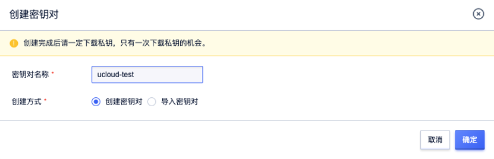

# 密钥对

密钥对（KeyPair）是一种常用于企业服务器批量管理的安全便捷的登录方式。
密钥对通过加密算法生成一对密钥（公钥和私钥），默认采用RSA 2048位的加密方式。

## 功能优势
相对于密码登录，密钥登录有以下优势：
* 安全性：SSH密钥对登录认证更为安全可靠。
* 便捷性：
  * 使用私钥通过SSH客户端登录目标实例，不需要输入密码。
  * 便于远程登录批量Linux实例，方便管理。

## 使用限制
使用SSH密钥对有如下限制：
* 仅支持Linux实例且支持CloudInit的实例
* 只支持创建2048位的RSA密钥对。
* 控制台创建实例选择密钥登录时，一台Linux实例只能绑定一个密钥对。
* 如果创建实例时已绑定密钥对，重装系统绑定新的密钥对会替换原来的密钥对。
* 如果您有使用多个密钥对登录实例的需求，可以在实例内部手动修改```~/.ssh/authorized_keys```文件，添加多个密钥对。

## 生成方式
* UCloud云提供的接口生成。默认采用RSA 2048位的加密方式。具体操作参见[创建主机密钥对](https://docs.ucloud.cn/api/uhost-api/create_uhost_key_pair)。
>注意：如果您的密钥对由控制台的创建密钥对功能生成，那么在首次生成密钥对时，请务必下载并妥善保存私钥。当该密钥对绑定某台实例时，如果没有私钥，您将无法登录实例。
* 用户采用SSH密钥对生成器生成。导入的密钥对仅支持ssh-rsa加密方式。

## 使用方法
* 创建/导入密钥对


>**注意**：
>成功创建SSH密钥对后，UCloud会保存SSH密钥对的公钥部分。在Linux实例中，公钥内容放在```~/.ssh/authorized_keys```文件内。
>您需要下载并妥善保管私钥。私钥使用未加密的PEM（Privacy-Enhanced Mail）编码的PKCS#8格式。

* 创建/重装系统时选择密码登录，选择刚刚创建的密钥。


* 打开SSH客户端
* 查找您的私钥文件。例如私钥文件为```ucloud-test.cer```
* 如有需要，运行此命令，以确保您的密钥不可见，示例：
```bash
chmod 400 ucloud-test.pem
```
* 连接到您的实例，示例：
```bash
ssh -i ~/Desktop/ucloud-test.pem  root@113.31.112.80 
```
